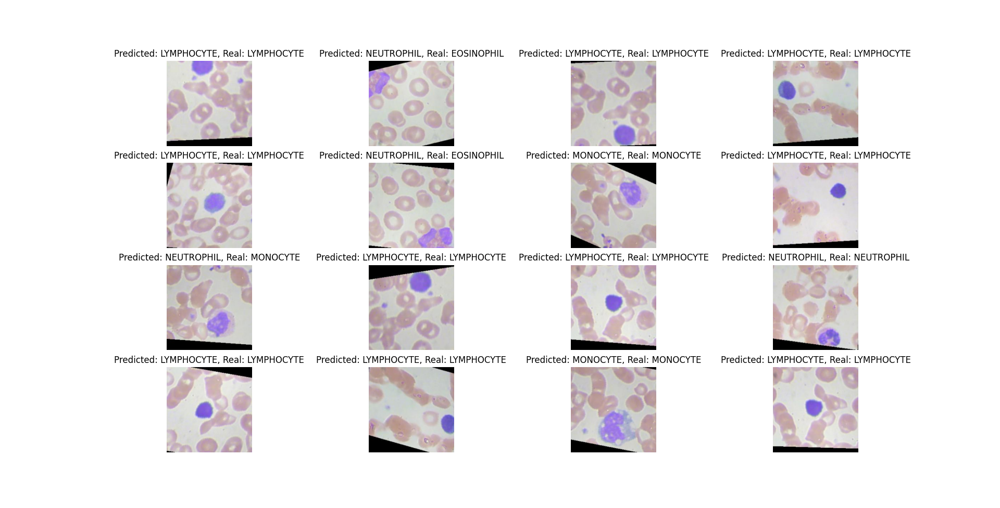

# Blood_cells
## Description
Creating a model to classify images of blood cells into 4 classes, using the Kaggle dataset [Blood Cell Images](https://www.kaggle.com/paultimothymooney/blood-cells).

## Approach
I used the ResNet50 model with my own classification layer. I use the pretrained weights for the rest of the network, which acts as a feature extractor, and I only train the classifier layer on my dataset.

## Implementations
Both the resnet.py and resnet_own.py do the same task, but the resnet_own.py file contains my implementation of the layers of the ResNet50 model which I then load the pretrained weights to. Both models perform identically.

## Results
It achieves over 60% on the test set after 5 training epochs, which could improved since I haven't done much hyperparameter tuning.

